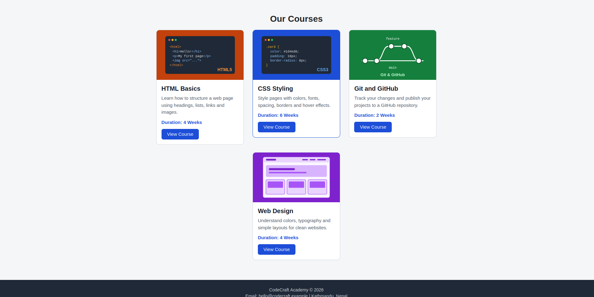
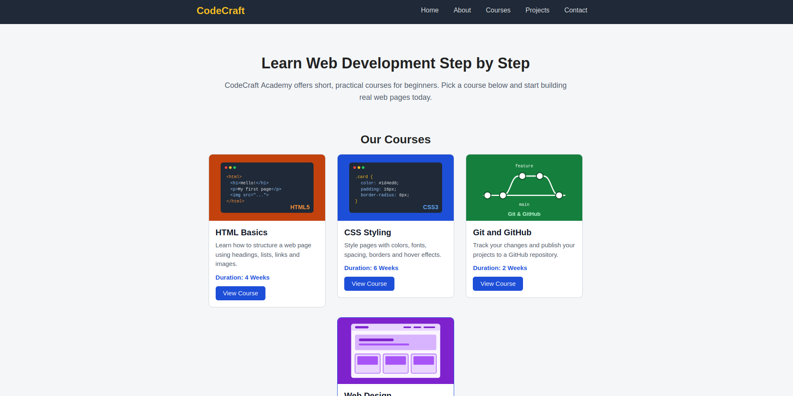

# HTML & CSS Assignment – Navigation Bar and Card Components

## 1. Student Information

- **Student Name:** Niraj Yadav
- **Student ID:** 2602412481
- **Module Name:** Web Technologies and Platforms
- **Assignment Title:** Designing a Navigation Bar and Card Components Using HTML & CSS

## 2. Project Description

This project is a basic HTML and CSS webpage containing a navigation bar, a course card, a multiple-card section and a complete page layout (header, main content, cards, footer). It demonstrates the HTML structure and fundamental CSS styling techniques learned in the module. No Flexbox, CSS Grid, frameworks or JavaScript were used.

## 3. Technologies Used

- HTML5
- CSS3

## 4. Learning Resources

| No. | Resource | Link | Topic Learned | What I Learned | How I Used It |
|-----|----------|------|---------------|----------------|---------------|
| 1 | Teacher's Material (class notes) | Course notes / LMS | CSS Selectors | Element selectors target all tags of one type (like `body`), class selectors (`.course-card`) target a group of elements, and ID selectors target one unique element. | I used class selectors for the navbar, cards and buttons, and an element selector for `body` to set the font and background. |

| 2 | MDN Web Docs | https://developer.mozilla.org/en-US/docs/Learn_web_development/Core/Styling_basics/Box_model | CSS Box Model | Padding is the space between content and border, border surrounds the padding, and margin is the space outside the border. | I used padding in `.card-body` so text does not touch the edges, and margin on `.course-card` to separate the cards. |

| 3 | YouTube Tutorial | apnacollege.html.css | Navigation Bar | How to remove list bullets (`list-style: none`), remove link underlines (`text-decoration: none`) and style links with `:hover`. | I styled the navbar links with padding and a hover color and underline so the link changes when the mouse moves over it. |

| 4 | W3Schools | https://www.w3schools.com/css/css_float.asp | float and inline-block | `float` moves an element left or right so others sit beside it, and `display: inline-block` lets elements sit side by side while keeping width, height, margin and padding. | I used `float` for the navbar items and `inline-block` to place the cards in rows without Flexbox or Grid. |

| 5 | MDN Web Docs | https://developer.mozilla.org/en-US/docs/Web/CSS/object-fit | Image properties | `width`, `height` and `object-fit: cover` make an image fill its box without being stretched. | I set card images to `width: 100%`, `height: 160px` and `object-fit: cover` so all cards look consistent. |

## 5. Screenshots

### Navigation Bar

### Single Card

### Multiple Cards

### Complete Website

## 6. What I Learned

- **HTML page structure:** every page has `<!DOCTYPE html>`, `<html>`, `<head>` and `<body>`, and the CSS file is linked in the `<head>`.
- **Semantic HTML:** I used `header`, `nav`, `main`, `section`, `article` and `footer` so the page structure is clear.
- **CSS selectors:** element selectors, class selectors and descendant selectors such as `.nav-links a` select exactly the elements I want to style.
- **Colors, fonts and text:** I used `color`, `background-color`, `font-family`, `font-size`, `font-weight`, `text-align`, `line-height` and `text-decoration`.
- **Box model:** margin is space outside the border, padding is space inside the border, and border goes between them.
- **Border radius:** rounds the corners of the cards and buttons.
- **Images:** `width`, `height` and `object-fit: cover` keep images consistent.
- **Hover effects:** `:hover` changes the look of links, buttons and cards when the mouse is over them.
- **Alignment:** `margin: 0 auto` centers a block, `text-align: center` centers text, and `float` and `inline-block` place items side by side.

## 7. Challenges and Solutions

- **Challenge 1:** The navigation links were stacked vertically, with bullets, instead of in a row.
  **Solution:** I removed the bullets with `list-style: none` and used `float: left` on each `li` so they sit in a row.

- **Challenge 2:** The cards were stacked one below another instead of side by side.
  **Solution:** I used `display: inline-block` on `.course-card` and set a fixed width and margin so three cards fit in each row.

- **Challenge 3:** The card images had different shapes and looked stretched.
  **Solution:** I set a fixed height and `object-fit: cover` on the images so they fill the card evenly.

## 8. AI Usage

I used Claude (Anthropic) as a learning assistant.

- **What I asked:** I asked for help creating a starting structure for the navigation bar, cards, README and learning-resource table without using Flexbox, Grid or frameworks.
- **What I learned:** I learned how semantic tags organise a page, how `float` and `inline-block` can place items side by side, and how the box model controls spacing.
- **What I changed or implemented myself:** I tested the code in my browser, edited the text, colors and images, wrote my own README content, took the screenshots, and can explain each part of my code.